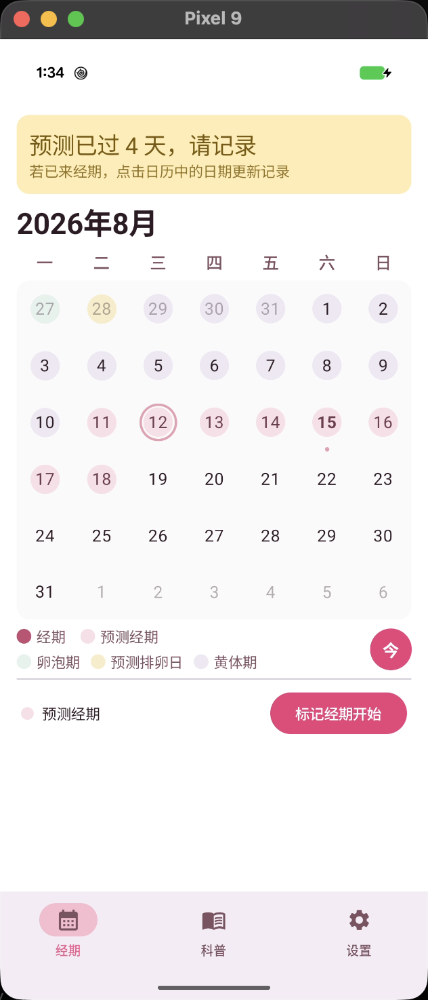
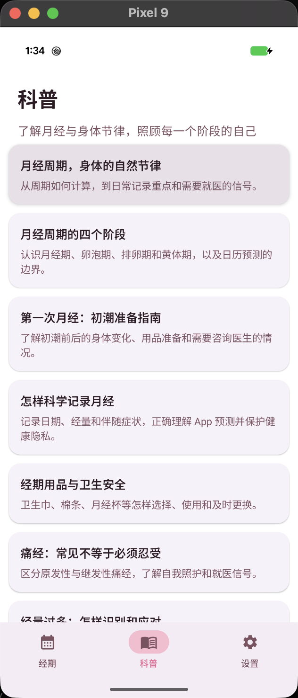
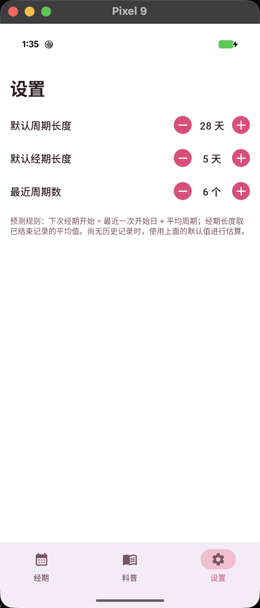

# Pinkdiary（粉日记）

<p align="center">
  
</p>

一款记录与预测女性经期的 Android 应用。用户通过日历记录每次经期的开始与结束日期，应用根据历史记录自动预测下一次经期的开始、结束与持续时间。

## 应用预览

| 经期 | 科普 | 设置 |
|:---:|:---:|:---:|
|  |  |  |

## 功能特性

- **日历记录**：周一开头的月历，左右滑动翻页；点击日期即可标记经期开始 / 结束 / 删除
- **经期预测**：基于历史周期与经期长度，预测下次经期的开始日、结束日与持续时间
- **周期阶段**：以低对比标记展示预测卵泡期、排卵日与黄体期（仅供记录参考，不可用于避孕）
- **周期状态**：状态卡展示「经期中第 X 天 / 距下次经期 X 天 / 预测今天开始 / 预测已过期」等状态
- **设置**：默认周期长度、默认经期长度、参与平均的最近周期数
- **首次启动引导**：三页介绍（记录 / 预测 / 隐私），可跳过，仅首次展示
- **月经科普**：内置 15 篇经权威资料整理的离线文章；列表展示标题与摘要，详情原生渲染本地 Markdown，跟随粉色主题与深色模式
- **底部导航**：经期 / 科普 / 设置
- **主题**：粉白配色、支持深色模式；低饱和藕粉标记 + 马卡龙色翻页背景

## 技术栈

| 分类 | 技术 |
|------|------|
| 语言 | Kotlin 2.2 |
| UI | Jetpack Compose + Material 3 |
| 富文本 | Multiplatform Markdown Renderer（Material 3） |
| 架构 | 单 Activity + 严格 MVI + Repository（手动 DI） |
| 持久化 | Room（经期记录）、DataStore Preferences（设置 / 引导状态） |
| 导航 | Navigation Compose（底部导航） |
| 依赖注入 | 手动（`PinkdiaryApp` 容器） |

> 版本详情见 `gradle/libs.versions.toml`。

## 构建与运行

环境要求：JDK 17+、Android SDK（`compileSdk 37`）。

```bash
# 编译 Debug APK
./gradlew :app:assembleDebug
# 产物：app/build/outputs/apk/debug/PinkDiary-v1.0.0-debug.apk

# 运行单元测试
./gradlew :app:testDebugUnitTest

# 完整构建 + 单测
./gradlew clean :app:assembleDebug :app:testDebugUnitTest
```

安装到设备：`./gradlew :app:installDebug`，或直接用 Android Studio 运行。

应用版本统一在 `app/build.gradle.kts` 顶部的 `appVersionCode` 与 `appVersionName` 中维护。APK 基础命名为 `PinkDiary-v{versionName}-{buildType}.apk`；未签名的 Release 包由 Android Gradle Plugin 自动追加 `-unsigned`。

## 测试

单元测试位于 `app/src/test/`，覆盖纯逻辑层与 MVI 状态持有者：

- `CyclePredictorTest` —— 预测算法（冷启动 / 多周期平均 / 异常值过滤 / 进行中）
- `CalendarMarksTest` —— 日历标记集合
- `PeriodLogicTest` —— 记录查询
- `StatusCardTest` —— 状态卡文案
- `KnowledgeCatalogTest` —— 科普目录数量、文章 ID 与资源映射
- `AppViewModelTest` / `HomeViewModelTest` / `SettingsViewModelTest` —— `Intent -> State / Effect`

## 文档

- [功能方案设计](docs/FEATURE_DESIGN.md)
- [经期计算与预测规则](docs/PERIOD_PREDICTION_RULES.md)
- [Compose + MVI 编码架构规范](docs/COMPOSE_MVI_ARCHITECTURE.md)
- [AI 协作指南](AGENTS.md)
